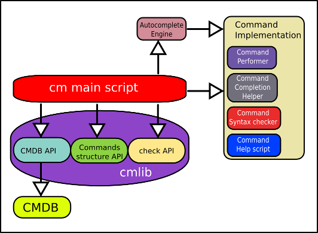
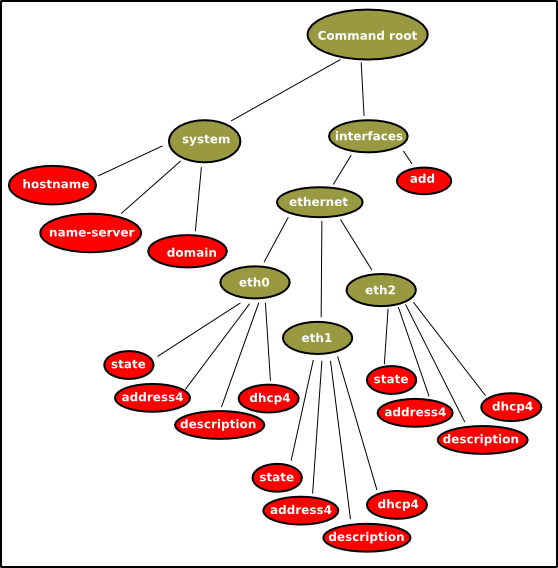

****************
CM: il framework
****************

=======================
Struttura del framework
=======================

Il framework si compone di:

* un CMDB
* una API per accedere al CMDB (vedi :ref:`cmdb API <cmdb_api>`)
* il comando `cm`
* un sistema di autocompletamento che sfrutta la bash completion [1]_ adattabile ad ogni comando
* un sistema di help per ogni cmando
* un sistema di verifica della sintassi dei comandi

---------------
Concetti chiave
---------------

^^^^^^^^^^^^^^^^
Esecuzione di cm
^^^^^^^^^^^^^^^^

Tutte le attività di configuration management vengono effettuati tramite dei comandi a partire dallo script cm.

Ad Esempio: ::

   cm interfaces ethernet eth0 address4 192.168.12.20/24

Assegna l'ip `192.168.12.20/24` all'interfaccia `eth0`. `cm` è il main script che si occupa di interpretare tutto il resto della linea di comando, verificare la sintassi (**Command Syntax Checker**) ed eventualmente eseguire il comando (**Command Performer**) oppure richiamare l'help del comando (**Command Help Script**) se il parametro è **?**.
Prima della verifica della sintassi il comando viene completato *automagicamente* richiamando il **Command Completion Helper**.

^^^^^^^^^^^^^^^^^^^^^
Livelli di esecuzione
^^^^^^^^^^^^^^^^^^^^^

`cm` supporta almento 2 livelli di funzionamento (volendo sono espandibili facilmente).

* **operation mode**: questo livello è un livello non privilegiato, tutti i comandi vengono eseguiti con i privilegi dell'utente definito dalla variabile `__cm_operator_user` ed ha accesso ai soli comandi contenuti in `__cm_operator_libexec_dir`. L'utente di default in questa modalità è `cm`.
* **configuration mode**: Questo è un livello privilegiato, i comandi vengono eseguiti con l'utente definito da `__cm_configure_user` (per default ha uid 0) e i comandi disponibili sono nel path definito da `__cm_configure_libexec_dir`. L'utente di default in questa modalità è `cmsu`.

^^^^^^^^^^^^^^^^^^^^^^^^^^^^^^^^^^^^^
Configurazione e variabili d'ambiente
^^^^^^^^^^^^^^^^^^^^^^^^^^^^^^^^^^^^^

`cm` si appoggia ad un set di variabili d'ambiente per la propria configurazione:

Per eseguire `cm` occorre autenticarsi sul sistema tramite uno degli utenti definiti dai livelli di esecuzione. Una volta effettuato l'accesso il `~/.bash_profile` si occupa di impostare le variabili d'ambiente e gli alias necessari.

**Variabili d'ambiente :**

* **__cm_lib_dir**: direcory in cui risiede :mod:`cmlib`
* **__cm_operator_libexec_dir**: root directory contenente i comandi **operation mode**
* **__cm_configure_libexec_dir**: root directory contenente i comandi **configuration mode**
* **__cm_libexec_dir**: root directory dei comandi della sessione attiva (**operation mode** o **configuration mode**)
* **__cm_operator_user**: username utilizzato in **operation mode**
* **__cm_configure_user**: username utilizzato in **configuration mode**
* **__cm_db_dir**: directory contenete il **CMDB**
* **__cm_bin**: il nome del comando **cm**
* **__cm_default_priority**: priorità di default per i comandi che non dichiarano la priorità
* **__cm_bin_dir**: directory contenete i binari o script di appoggio
* **__cm_config_db**: file in cui viene salvato il **CMDB** (utilizzato dal comand `cm save` in **configuration mode**)
* **__cm_prompt**: il prompt corrente

**Variabili d'ambiente di default non impostate:**

* **__cm_no_command**: se impostata a 1 vengono stampate le informazioni di debug
* **__cm_debug**: se impostata a 1 il comando viene inteso come una negazione (simile ai `no commands` sulle CLI cisco)

.. _command-hierarchy:

^^^^^^^^^^^^^^^^^^^^^
Gerarchia dei comandi
^^^^^^^^^^^^^^^^^^^^^

I comandi `cm` hanno una struttura gerarchica ad albero navigabile tramite tab-completion.

   Un esempio di albero dei comandi di cm

.. note:: 
   I nodi verdi sono dei rami dell'albero dei comandi (`command branches`).
   I nodi rossi sono le foglie dei comandi (`command leaf`).
   
   I `command branches` servono a creare la struttura gerarchica, mentre i `command leaf` si occupano di implementare il comando vero e proprio.

Un comando, per essere completo deve indicare tutto il percorso per raggiungere una foglia piu eventuali parametri. Es.: ::
   
   cm interfaces ethernet eth0 state active
   |  |          |        |    |     |
   |  +----------+--------+    |     +-parametro
   |                      |    |
   +-comando cm           |     +-foglia
                          |
                          +-percorso

Questo comando eseguirà `$__cm_libexec_dir/interfaces/ethernet/eth0/state`.

^^^^^^^^^^^^^^^^^^^^^^^^^^^^^^^^^^^^^^^^^
Struttura dei comandi: `command branches`
^^^^^^^^^^^^^^^^^^^^^^^^^^^^^^^^^^^^^^^^^

I `command branches` di fatto sono delle sotto directory del path definito da `$__cm_libexec_dir`. Un `command branch` può definire una propria priorità con cui verrà mostrato nel comando `cm show`. La priorità viene definita creando un file di nome `_priority` nella directory del branch contente il valore di priorità.

Un branch con priorità piu' alta verrà listato piu' in basso dal comando `cm show` e `cm save`.

^^^^^^^^^^^^^^^^^^^^^^^^^^^^^^^^^^^^^
Struttura dei comandi: `command leaf`
^^^^^^^^^^^^^^^^^^^^^^^^^^^^^^^^^^^^^

Il `command leaf` è la parte principale dell'implementazione di un comando: definisce

#. il **command performer**
#. il **command syntax checker**
#. il **command completion helper** che si occupa dell'autompletamento dei parametri
#. il **command help script** che si occupa di documentare lo script
#. la priorità rispetto alle altre foglie del branch
#. se il comando gode di atocompletamento dei parametri

I primi quattro punti sono a tutti gli effetti degli script (volendo anche dei binari), ma comunque degli eseguibili. Gli ultimi due sono dei semplici file di testo.
Tornando all'esempio sopra, eseguendo il comando::
   
   cm interfaces ethernet eth0 state

verranno eseguiti due script:

Prima il **command syntax checker** chiamando lo script `$__cm_libexec_dir/interfaces/ethernet/eth0/_state_syntax` passandogli come parametri tutti i parametri del comando `cm`, quindi verrà eseguito: ::

   $__cm_libexec_dir/interfaces/ethernet/eth0/_state_syntax interfaces ethernet eth0 state active

Se questo script ritorna un valore diverso da `0` verrà interrotta l'esecuzione e stampato un messggio d'errore. Esempio: ::

   cm interfaces ethernet eth0 state notexistatntstatement
   Error: Invalid syntax

Se invece ritorna `0` verrà eseguito il **command performer** passandogli sempre tutti i parametri del comando cm. Nel caso dell'esempio il **command performer** è lo script `$__cm_libexec_dir/interfaces/ethernet/eth0/state` e verrà eseguito::

   $__cm_libexec_dir/interfaces/ethernet/eth0/state interfaces ethernet eth0 state active
   

passando come parametri tutto il path fino alla foglia piu' gli eventuali parametri. Quindi nel caso dell'esempio precedente verrà eseguito il comando::
  
   $__cm_libexec_dir/interfaces/ethernet/eth0/state interfaces ethernet eth0 state active

.. important:: 

  #. Un `command brach` è costituito da una directory, e puo' essere figlio di un'altro `command branch`. Un `command_branch` puo' definire una propria priorità tramite il file `_priority`.

  #. Un `command leaf` consiste in 6 file all'interno di un branch: 4 eseguibili e 2 testuali. I nomi dei file devono seguire questa policy:

     * il **command performer** deve essere un eseguibile, il nome del file da il nome alla foglia. Es: `address4`
     * il **command syntax checker** deve essere un eseguibile, il suo nome deve essere il nome della foglia prefisso da `_` e suffiso da `_syntax`. Es: `_address4_syntax`
     * il **command completion helper** deve essere un eseguibile, il suo nome deve essere il nome della foglia prefisso da `_` e suffiso da `_complete`. Es: `_addres4_complete`
     * il **command help script** deve essere un eseguibile, il suo nome deve essere il nome della foglia prefisso da `_` e suffiso da `_help`. Es: `_addres4_help`
     * la **priorità** è definità da un file con nome uguale al nome della foglia prefisso da `_` e suffisso da `_priority`. Es: `_address4_priority`
     * se il comando **non gode di autocompletamento dei parametri** deve esistere un file con nome uguale al nome della foglia prefisso da `_` e suffisso da `_nocomplete`. Es: `_address4_nocomplete`

^^^^^^^^^^^^^^^^^^^^^^^^^^^^^
Autocompletamento dei comandi
^^^^^^^^^^^^^^^^^^^^^^^^^^^^^

`cm` si appoggia alle funzionalità di command completion di `bash` e `readline`. L'esplorazione dell'albero dei comandi viene facilitata grazie a questa feature.
Esempio: ::

   > cm <tab><tab>
   configure  show
   > cm c<tab>

Nel primo comando, dopo aver digitato `cm` e premuto il tasto `tab` due volte vengono proposti i possibili `command breanches` o `leaf`. Digitando l'inizio di un comando il comando verrà completato alla pressione del tasto `tab`. Se dovessero esistere delle ambiguità (es, comandi che inizio per la stessa lettera) verranno mostrate le diverse possibilità.

Mentre si digita un comando l'autocomopletamento viene effettuato esplorando la :ref:`gerarchia dei comandi <command-hierarchy>`. Una volta digitato tutto il percorso fino alla foglia (`command leaf`) l'autocompletamento degli eventuali parametri viene demadato alla foglia stessa: viene eseguito **command completion helper** e il suo output viene utilizzato per generare i completamenti.
Se la `command leaf` non gode di autocompletamento (es. un parametro arbitrario tipo l'IP da assegnare ad una interfaccia di rete) il **command completion helper** viene eseguito ma il suo output non viene utilizzato come alternative per l'autocompletamento. Esempi:

**command leaf con autocompletamento:** ::

  cm interfaces ethernet eth0 state<tab><tab>
  active    inactive
  cm interfaces ethernet eth0 state a<tab>
  cm interfaces ethernet eth0 state active                            # "ctive" è stato aggiunto automagicamente

  ls $__cm_libexec_dir/interfaces/ethernet/eth0/*state* -1
  /opt/cm/configure-libexec/interfaces/ethernet/eth0/state            # command performer
  /opt/cm/configure-libexec/interfaces/ethernet/eth0/_state_complete  # command completion helper
  /opt/cm/configure-libexec/interfaces/ethernet/eth0/_state_help      # command help script
  /opt/cm/configure-libexec/interfaces/ethernet/eth0/_state_priority  # command priority
  /opt/cm/configure-libexec/interfaces/ethernet/eth0/_state_syntax    # command syntax checker

**command leaf senza autocompletamento:** ::
  
  cm interfaces ethernet eth0 address4 <tab><tab>
  xxx.xxx.xxx.xxx/yy - IP address and Netmask                               # viene mostrato un suggerimento per il parametro
  cm interfaces ethernet eth0 address4 192.<tab><tab>
  xxx.xxx.xxx.xxx/yy - IP address and Netmask
  cm interfaces ethernet eth0 address4 192.                                 # il comando non viene autocompletato

  ls $__cm_libexec_dir/interfaces/ethernet/eth0/*address4* -1
  /opt/cm/configure-libexec/interfaces/ethernet/eth0/address4               # command performer
  /opt/cm/configure-libexec/interfaces/ethernet/eth0/_address4_complete     # command completion helper
  /opt/cm/configure-libexec/interfaces/ethernet/eth0/_address4_help         # command help script
  /opt/cm/configure-libexec/interfaces/ethernet/eth0/_address4_nocomplete   # nocomplete flag 
  /opt/cm/configure-libexec/interfaces/ethernet/eth0/_address4_priority     # command priority
  /opt/cm/configure-libexec/interfaces/ethernet/eth0/_address4_syntax       # command syntax checker

==========================
Howto: Estendere i comandi
==========================

---------
Struttura
---------

bla bla bla

-------
Esempio
-------

esempio molto semplice

------------------------------
Esempio di uso di cmdb e cmlib
------------------------------

esempio piu' complesso

.. [1] Bash completion: http://bash-completion.alioth.debian.org
